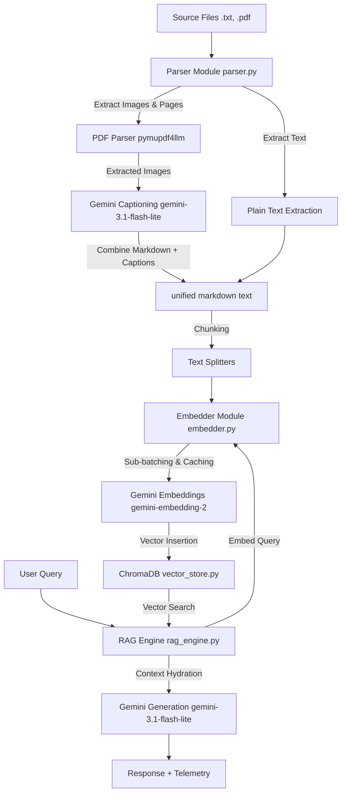

# System Architecture: Multi-Modal RAG Pipeline

This document details the design, logic flow, and components of the multi-modal RAG pipeline implemented in this project.

---

## High-Level System Flow



---

## 1. Document Ingestion & Parsing
Implemented in [parser.py](file:///home/serein/SourceCodes/eval-platform/ai-chat/parser.py).

* **Text Parsing**: Reads standard `.txt` files directly using UTF-8 encoding.
* **PDF Parsing**:
  * Employs `pymupdf4llm` to extract document structures directly as page-by-page markdown chunks.
  * Writes extracted images on disk to [assets/extracted_images/](file:///home/serein/SourceCodes/eval-platform/ai-chat/assets/extracted_images/).
  * For each extracted image:
    1. Renames it using a deterministic schema: `<pdf_basename>_page_<page_num>_img_<index>.<ext>`.
    2. Sends the image to `gemini-3.1-flash-lite` with a dense semantic technical captioning prompt.
    3. Replaces the inline markdown image reference `` with the caption info:
       ```markdown
       

       **Image Caption:** <description>
       ```
  * Combines pages with a custom page-break separator: `\n\n<!-- PAGE_{page_num} -->\n\n` to maintain page context in the vector database.
* **Fallback PDF Parsing**: If `pymupdf4llm` fails or is not available, uses `pypdf` as a text-only page-by-page fallback parser.

---

## 2. Embedding Module
Implemented in [embedder.py](file:///home/serein/SourceCodes/eval-platform/ai-chat/embedder.py).

* **Model**: Utilizes `gemini-embedding-2` for text vectorization.
* **Sub-Batching**: The Gemini embedding API restricts batch sizes to a maximum of 100 items per request. The module automatically slices larger chunk arrays into sub-batches of 100 to prevent `400 INVALID_ARGUMENT` API errors.
* **Caching Optimization**: Implements Python's `functools.lru_cache` at the batch-embedding level to cache identical vectorization requests (e.g. duplicate query embeddings during RAG retrieval and metric calculation), saving 50% on API call volume.

---

## 3. Persistent Vector Store
Implemented in [vector_store.py](file:///home/serein/SourceCodes/eval-platform/ai-chat/vector_store.py).

* **Database**: ChromaDB persistence at the [db/](file:///home/serein/SourceCodes/eval-platform/ai-chat/db/) directory relative to the module.
* **Index Collection**: Writes data chunks to the collection `ai_chat_docs`.
* **Metadata Schema**:
  ```json
  {
    "source_file": "document_name.txt",
    "page_number": 1,
    "content_type": "text" | "image_caption"
  }
  ```
* **Unique Identification**: Generates unique `UUIDv4` identifiers for every stored chunk to avoid document collision.

---

## 4. RAG Retrieval & Generation
Implemented in [rag_engine.py](file:///home/serein/SourceCodes/eval-platform/ai-chat/rag_engine.py).

* **Context Retrieval**:
  * Vectorizes user query and retrieves top matches ($N=3$) from ChromaDB.
  * Hydrates context using retrieved text chunks.
  * If a matched chunk corresponds to an image caption (`content_type == "image_caption"`), the engine extracts the image file path (`asset_path`) from its metadata.
* **Response Generation**:
  * Loads matched PIL Images into the generation context.
  * Submits both the hydrated text context and physical image payloads to `gemini-3.1-flash-lite`.
* **Telemetry**: Tracks token counts, generation provider/model, and query time using the `RuntimeState` context manager.

---

## 5. Robustness & Rate-Limit Handling

To support free-tier Google GenAI API keys (which are strictly capped at 15 Requests Per Minute):
1. **Exponential Retry Backoff**: All core API transactions (image captioning, embedding, and generation) are wrapped inside retry loops (up to 3 retries, starting with a 1-second delay and doubling each time).
2. **Cooldown Delays**: The benchmark runner enforces a 4.0-second delay between test cases to spread out request frequencies.
3. **Abort on Persistent 429**: If an API request fails after all retries due to a rate limit (`ResourceExhausted` or 429 error), the system raises the exception and immediately aborts the run to prevent hanging/stuck states.
