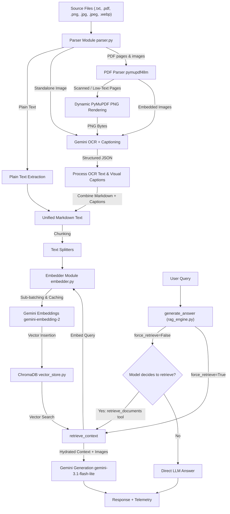

# System Architecture: Multi-Modal RAG Pipeline

This document details the design, logic flow, and components of the multi-modal RAG pipeline implemented in this project.

---

## High-Level System Flow



---

## 1. Document Ingestion & Parsing
* **Text Parsing**: Reads standard `.txt` files directly using UTF-8 encoding.
* **Standalone Image Ingestion**:
  * Supports `.png`, `.jpg`, `.jpeg`, and `.webp` formats.
  * Copies images to the `assets/extracted_images/standalone/` folder with a unique UUID prefix.
  * Passes image bytes to `gemini-3.1-flash-lite` using the structured OCR and captioning helper to extract both raw text and visual descriptors in a single call.
* **Structured OCR & Captioning**:
  * Utilizes a Pydantic schema `ExtractionResult` defining `extracted_text` (exact OCR text) and `visual_caption` (charts/drawings/figure descriptions).
  * Calls Gemini with `response_mime_type="application/json"` and `response_schema=ExtractionResult`.
* **Hybrid PDF Parsing**:
  * Employs `pymupdf4llm` to extract document structures page-by-page.
  * Writes extracted images on disk to `assets/extracted_images/<pdf_basename>/`.
  * **Dynamic Scanned Page Detection**:
    * If a page has less than `SCANNED_PAGE_TEXT_THRESHOLD = 100` characters of clean text (excluding image tags), it is flagged as scanned.
    * Flags scanned pages are rendered to in-memory PNG bytes using `fitz` (PyMuPDF) at 150 DPI and processed using the structured OCR helper.
    * Prepend the OCR text and captions to the page text to preserve any embedded image tags found.
  * **Embedded Image Processing**:
    * Renames images using a deterministic schema: `<pdf_basename>_page_<page_num>_img_<index>.<ext>`.
    * Sends image bytes to the structured OCR helper to obtain visual captions.
    * Replaces the inline markdown image reference `` with:
       ```markdown
       

       **Image Caption:** <description>
       ```
  * Combines pages with a custom page-break separator: `\n\n<!-- PAGE_{page_num} -->\n\n` to maintain page context in the vector database.
* **Fallback PDF Parsing**: If `pymupdf4llm` fails, uses `pypdf` as a text-only page-by-page fallback parser.

---

## 2. Embedding Module
* **Model**: Utilizes `gemini-embedding-2` for text vectorization.
* **Sub-Batching**: The Gemini embedding API restricts batch sizes to a maximum of 100 items per request. The module automatically slices larger chunk arrays into sub-batches of 100 to prevent `400 INVALID_ARGUMENT` API errors.
* **Caching Optimization**: Implements Python's `functools.lru_cache` at the batch-embedding level to cache identical vectorization requests (e.g. duplicate query embeddings during RAG retrieval and metric calculation), saving 50% on API call volume.

---

## 3. Persistent Vector Store
* **Database**: ChromaDB persistence at the [db/](file:///home/serein/SourceCodes/eval-platform/ai-chat/db/) directory relative to the module.
* **Index Collection**: Writes data chunks to the collection `ai_chat_docs`.
* **Metadata Schema**:
  ```json
  {
    "source_file": "document_name.txt",
    "page_number": 1,
    "content_type": "text" | "image_caption"
  }
  ```
* **Unique Identification**: Generates unique `UUIDv4` identifiers for every stored chunk to avoid document collision.

---

## 4. Agentic RAG Retrieval & Generation
* **Hybrid Execution Flow (`generate_answer`)**:
  * **Agentic Path (`force_retrieve=False`)**: The RAG engine defines a `retrieve_documents` tool using Gemini Function Calling. The initial LLM request sends the query along with the tool declaration and a system instruction.
    * If the model determines it needs document context, it outputs a function call. The engine catches the call, executes `retrieve_context()`, converts matched images directly into `types.Part.from_bytes` objects, and sends a follow-up conversation turn containing the function response.
    * If the model can answer from its own knowledge, it answers directly, bypassing vector store query overhead.
  * **Forced Path (`force_retrieve=True`)**: Unconditionally queries ChromaDB and injects context before executing a single-turn generation. Used by benchmarks and evaluation pipelines to ensure backward compatibility and deterministic trace histories.
* **Context Retrieval**:
  * Vectorizes user query and retrieves top matches ($N=3$) from ChromaDB.
  * Hydrates context using retrieved text chunks.
  * If a matched chunk corresponds to an image caption (`content_type == "image_caption"`), the engine extracts the image file path (`asset_path`) from its metadata and loads it as an image byte part.
* **Telemetry**: Tracks aggregated token counts from both LLM turns in the agentic loop, along with generation provider/model name, and execution latency under a single unified `track_generation()` trace block. Individual retrieval steps are logged to `track_retrieval()` only when context is actually retrieved.

---

## 5. Robustness & Rate-Limit Handling

To support free-tier Google GenAI API keys (which are strictly capped at 15 Requests Per Minute):
1. **Exponential Retry Backoff**: All core API transactions (image captioning, embedding, and generation) are wrapped inside retry loops (up to 3 retries, starting with a 1-second delay and doubling each time).
2. **Cooldown Delays**: The benchmark runner enforces a 4.0-second delay between test cases to spread out request frequencies.
3. **Abort on Persistent 429**: If an API request fails after all retries due to a rate limit (`ResourceExhausted` or 429 error), the system raises the exception and immediately aborts the run to prevent hanging/stuck states.
