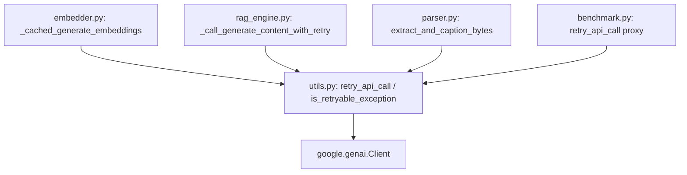

# Specification: Exponential Retry for LLM Calls in `ai-chat` on 429 and 503/5xx Status Codes

**Date:** 2026-06-23  
**Status:** Proposed  
**Scope:** `ai-chat/` module  

---

## 1. Objective
Refine the retry behavior for all Google GenAI calls (embedding and content generation) in the `ai-chat` module. Currently, these calls catch-all exceptions for retries. We want to implement a unified, synchronous utility that specifically handles transient, retryable failures—such as rate limits (`429`), service unavailabilities (`503`), other `5xx` server errors, network connections, and timeouts—using exponential backoff with full jitter.

---

## 2. Architecture & Design
We will introduce a shared synchronous module [utils.py](file:///home/serein/SourceCodes/eval-platform/ai-chat/utils.py) in the `ai-chat` directory. 

### 2.1 Component Diagram

### 2.2 Exception Filter Criteria
The `is_retryable_exception` function checks if a raised exception qualifies for a retry:
1. **Standard Python Exceptions:** `ConnectionError`, `TimeoutError` (representing transient networking issues).
2. **Google Server Errors:** `google.genai.errors.ServerError` (which covers `5xx` errors from the Gemini API).
3. **Google Client Rate Limits & Server Codes:** `google.genai.errors.APIError` where the `code` attribute (cast to `int` if possible) matches:
   - `429` (Quota limits / Rate limits)
   - `500`, `502`, `503`, `504` (Transient server-side HTTP errors)

All other exceptions (e.g. `ValueError`, `KeyError`, `google.genai.errors.ClientError` with `400` or `404` status codes) are considered permanent client errors and must **not** be retried.

### 2.3 Jitter and Backoff Formula
The delay before retry `attempt` is calculated as follows:
- **Base delay boundary:** `delay = min(max_delay, initial_delay * (2 ** (attempt - 1)))`
- **Actual sleep time (Full Jitter):** `sleep_time = random.uniform(0, delay)`

---

## 3. Integration Plan

### 3.1 `ai-chat/utils.py` (New File)
Exposes the core functions `is_retryable_exception`, `retry_api_call`, and a `@with_retry` decorator.

### 3.2 `ai-chat/embedder.py`
Imports `retry_api_call` from `utils`. Replaces the manual retry block in `_cached_generate_embeddings` by wrapping the `client.models.embed_content` inside `retry_api_call`.

### 3.3 `ai-chat/rag_engine.py`
Imports `retry_api_call` from `utils`. Replaces `_call_generate_content_with_retry` internals to delegate to the shared `retry_api_call`.

### 3.4 `ai-chat/parser.py`
Imports `retry_api_call` from `utils`. Updates `extract_and_caption_bytes` to wrap the OCR/captioning request in `retry_api_call`.

### 3.5 `ai-chat/benchmark.py`
Imports `retry_api_call` from `utils` to replace its local redundant utility function.

---

## 4. Testing & Verification

### 4.1 Unit Testing (`test_utils.py` - New File)
- **`test_is_retryable_exception`**: Tests a suite of exceptions to ensure only `ServerError`, `APIError(429/503)`, `ConnectionError`, and `TimeoutError` return `True`.
- **`test_retry_api_call_success`**: Mock API fails twice and succeeds on the third attempt.
- **`test_retry_api_call_non_retryable_fails`**: Mock API fails with `ValueError` and is not retried.
- **`test_retry_api_call_exhausted`**: Mock API consistently fails with a retryable error, raising the final exception after max retries.
- **`test_with_retry_decorator`**: Verifies that functions decorated with `@with_retry` execute the retry logic correctly.

### 4.2 Updating Existing Test Mocking
Because the old tests mock-raise generic `Exception` which will no longer be retried, we must update:
- `test_embedder.py`: Change mocked exception types to `APIError(code=429)` or `ServerError(code=503)`.
- `test_rag_engine.py`: Change mocked exception types to `APIError(code=429)`.
- `test_parser.py`: Change mocked exception types to `APIError(code=429)`.

---

## 5. Trade-Off Analysis
1. **Synchronous Helpers vs. Async Decorators:** The backend of `eval-platform` utilizes an async retry decorator. However, `ai-chat` is a synchronous streamlit/ingestion app. Introducing async calls would cascade complexity into non-async parts of the code. A dedicated synchronous utility satisfies simplicity.
2. **Jitter Default:** Adding random jitter prevents concurrent streamlit sessions from hitting the LLM API at the exact same intervals, reducing overall probability of successive rate limits.
