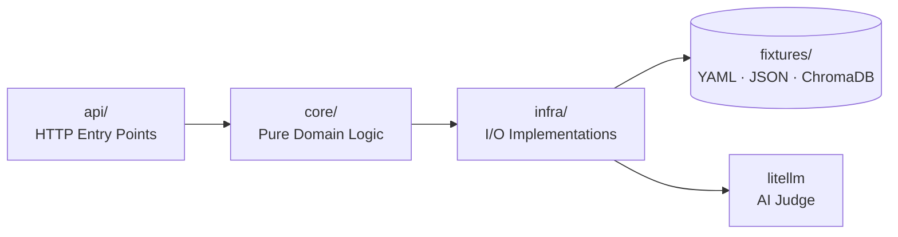

# EvalPlatform — Folder Structure Report

> High-level overview of the monorepo layout, architectural rationale, and framework decisions.

---

## Monorepo Root

```
eval-platform/
├── backend/          ← Evaluation engine & REST API
├── frontend/         ← Dashboard UI
├── sdk/              ← Python instrumentation SDK
├── ai-chat/          ← Reference RAG demo app
└── docs/             ← Documentation & reports
```

**Why a monorepo?** A single `uv` workspace shares one lockfile across all Python packages (`backend`, `sdk`, `ai-chat`). Version drift is impossible. Root-level `pyproject.toml` enforces shared linting (`ruff`) and type checking (`mypy`) uniformly.

---

## `backend/` — Evaluation Engine

```
backend/
├── app/
│   ├── api/          ← HTTP layer (routers, endpoints, request/response schemas)
│   ├── core/         ← Pure domain logic (eval engine, models, agents, shared utils)
│   └── infra/        ← I/O implementations (file repos, external services, vector store)
├── fixtures/         ← File-system "database" (YAML metrics, JSON datasets, etc.)
└── tests/            ← pytest test suite
```

### Architecture: Ports & Adapters (Hexagonal)



| Layer | Rule |
|-------|------|
| `api/` | No business logic. Thin HTTP adapters only. |
| `core/` | **Zero I/O.** No file reads, no network calls. Fully testable in isolation. |
| `infra/` | Concrete implementations of `core/` interfaces. Swappable (file → DB → cloud). |

**`fixtures/` as the database:** Zero infrastructure to run locally. YAML/JSON files are human-readable, hand-editable, and Git-trackable. The hexagonal boundary means swapping to Postgres requires only new `infra/` implementations — no core logic changes.

### Key Frameworks

| Framework | Justification |
|-----------|---------------|
| **FastAPI** | Async-native, automatic OpenAPI docs, Pydantic integration out of the box. |
| **Pydantic v2** | Strict `RuntimeState` validation at the API boundary. Rust-backed (~10x faster than v1). |
| **litellm** | Provider-agnostic LLM calls. Swap GPT-4 → Gemini → Claude without code changes. |
| **google-genai** | Powers the internal Metric Agent (tool-calling for autonomous YAML generation). |
| **ChromaDB** | Local, zero-infra vector store for document semantic search. |
| **Jinja2 + PyYAML** | YAML is the user-facing metric config format. Jinja2 renders prompt templates dynamically. |

---

## `sdk/` — Python Instrumentation SDK

```
sdk/
├── src/
│   └── evalplatform_sdk/   ← Installable package (src layout)
└── tests/
```

The `src/` layout is a deliberate choice: it enforces that the package must be installed (`pip install -e .`) rather than imported directly from the filesystem. The package ships a `py.typed` marker (PEP 561) so downstream users get full IDE autocompletion and mypy checking.

**Design philosophy:** Users instrument their code with context managers (`with state.track_generation()`) — timing, event appending, and error handling are automatic. Zero boilerplate.

### Key Frameworks

| Framework | Justification |
|-----------|---------------|
| **Pydantic v2** | `RuntimeState` and `RuntimeEvent` are the canonical data contracts shared with the backend. |
| **httpx** | Async-capable HTTP client for pushing events to the backend API. |

---

## `frontend/` — Dashboard UI

```
frontend/
├── app/           ← Next.js App Router pages (one folder per domain)
├── components/    ← UI components (mirrors app/ structure by domain)
├── hooks/         ← Custom React hooks
├── lib/           ← API clients, utility functions
├── types/         ← TypeScript type definitions
└── public/        ← Static assets
```

`components/` mirrors `app/` exactly — each feature domain owns its own components. A `ui/` subfolder inside `components/` holds only generic, unstyled primitives (Button, Input, Modal). Domain logic never bleeds into `ui/`.

### Key Frameworks

| Framework | Justification |
|-----------|---------------|
| **Next.js 16 (App Router)** | RSC for data-fetching pages; API routes as BFF for AI streaming in the playground. |
| **React 19** | Latest stable with concurrent features for interactive components. |
| **TypeScript 5** | Strict typing that mirrors the Pydantic-enforced backend contract. |
| **Tailwind CSS v4** | CSS-first config, zero runtime overhead, co-located with components. |
| **shadcn/ui** | Copy-paste primitives — full markup control, no opaque component library. |
| **Zod v4** | Runtime form validation that shares shape conventions with backend Pydantic models. |
| **Vercel AI SDK** | Native SSE streaming for the playground's `useChat` hook. |
| **Framer Motion** | Production-quality animations for page transitions and result reveals. |

---

## `ai-chat/` — Reference Demo App

```
ai-chat/
├── db/       ← Local ChromaDB instance
└── ...       ← FastAPI RAG chat app using the SDK
```

A self-contained RAG chatbot that instruments itself with `evalplatform_sdk`. It serves three purposes:
1. End-to-end integration test for the SDK.
2. Live demo for onboarding new users.
3. Dog-food target — the platform evaluates its own reference app.

---

## Summary Matrix

| Layer | Language | Primary Framework | Role |
|-------|----------|-------------------|------|
| Backend API | Python 3.12 | FastAPI + uvicorn | Eval engine, event ingestion, REST API |
| Evaluation Engine | Python 3.12 | Pure Python | Metric execution, orchestration |
| Vector Storage | Python 3.12 | ChromaDB | Semantic document search |
| SDK | Python 3.12 | Pure Python | User-facing instrumentation library |
| Frontend | TypeScript | Next.js 16 | Dashboard, playground, results UI |
| Tooling | Python 3.12 | uv workspace | Dependency mgmt, linting, testing |
