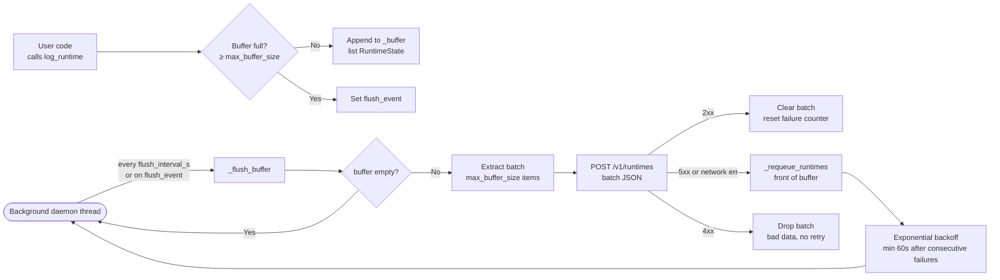
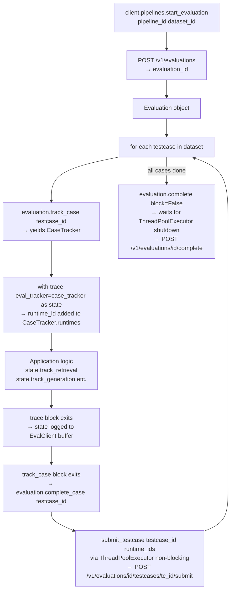

# Report: EvalPlatform SDK

> Covers the public API surface, telemetry transport architecture, tracing patterns, and batch evaluation workflow.

---

## Overview

The SDK is the only entry point for user applications to send telemetry to EvalPlatform. It has two responsibilities:

1. **Telemetry ingestion** — instrument application code with zero-boilerplate context managers; data is buffered and dispatched asynchronously without blocking the host process.
2. **Management** — programmatic access to all backend resources (datasets, metrics, pipelines, documents, agent).

**Public surface** (everything exposed in `__all__`):

| Symbol | Type | Role |
|--------|------|------|
| `EvalClient` | class | Initialise the SDK, holds transport + sub-clients |
| `trace` | context manager | Wrap a turn of execution; auto-logs on exit |
| `capture_trace` | decorator | Wrap a function; auto-logs on exit |
| `RuntimeState` | model | The canonical telemetry payload for one turn |
| `RuntimeEvent` | model | A single sub-event inside a `RuntimeState` |
| `Artifact` | model | A multimodal attachment (image caption, OCR text, etc.) |
| `current_evaluation_runtimes` | ContextVar | Auto-binding hook for evaluation batch runs |

---

## 1. `EvalClient` — Transport Architecture

`EvalClient` is instantiated once globally. The first instance registers itself as the process-level default; all helpers call `get_default_client()` to reach it without explicit passing.

### Two separate HTTP clients

```
EvalClient
├── _http_client         (telemetry)
│   ├── timeout: 10s connect, 5s
│   ├── max_connections: 10
│   └── POST /v1/runtimes (batch)
│
└── _management_client   (management APIs)
    ├── timeout: 30s
    └── GET/POST/PUT/DELETE /v1/configs, /v1/datasets, /v1/agent, /v1/documents
```

The telemetry client is intentionally short-timeout — a slow backend should never block the user's application. The management client has a longer timeout since those operations are explicit and synchronous.

### Buffer + background worker



**Key parameters:**

| Parameter | Default | Meaning |
|-----------|---------|---------|
| `flush_interval_seconds` | 3.0 | How long the background thread sleeps between flushes |
| `max_buffer_size` | 50 | Batch size per HTTP request |
| `max_buffer_capacity` | 15000 | Hard cap; oldest items dropped if exceeded |

**Graceful degradation chain:**

1. Backend not initialized → `NullClient` returned (no-op, no crash)
2. Backend 5xx → runtimes requeued at the front; exponential backoff up to 60s
3. Backend 4xx → batch dropped (bad data, retrying is pointless)
4. Buffer capacity exceeded → warning logged, incoming runtime dropped
5. Process exit → `atexit.register(flush_sync)` drains the buffer before shutdown

---

## 2. `RuntimeState` — The Canonical Payload

One `RuntimeState` = one turn of the AI application (one user request/response cycle).

```
RuntimeState
├── runtime_id     str (UUID)       unique trace identifier
├── events         list[RuntimeEvent]
│   ├── GenerationPayload   provider, model, input_text, prompt, output_text, tokens, latency_ms
│   ├── RetrievalPayload    query, chunks (document, content, confidence), latency_ms
│   └── FileProcessedPayload file_name, processor (ocr | file_reader), content, latency_ms
├── usage          ResourceUsage   input_tokens, output_tokens, latency_ms, memory_mb, estimated_cost_usd
├── artifacts      list[Artifact]  multimodal attachments (document/text, document/pdf, image/ocr, etc.)
└── metadata       dict | None     arbitrary extra data
```

Sub-events are appended by context managers on the `RuntimeState` itself. All latency is auto-calculated from context manager entry/exit — the user never passes timestamps.

---

## 3. Tracing Patterns

### Pattern A — `trace()` context manager (explicit, full control)

```python
with trace() as state:
    with state.track_retrieval() as rt:
        rt.query("What is the total amount due?")
        results = vector_db.search(...)
        for r in results:
            rt.add_chunk(document=r.file, content=r.text, confidence=r.score)

    with state.track_generation() as gt:
        gt.model_info(provider="openai", model_name="gpt-4o")
        gt.user_input("Extract the total from the context.")
        response = llm.generate(...)
        gt.token_usage(response.prompt_tokens, response.completion_tokens)
        gt.output_text(response.content)

    state.usage.input_tokens = response.prompt_tokens
    state.usage.output_tokens = response.completion_tokens
# ↑ RuntimeState auto-logged to EvalClient on exit
```

`trace()` yields a live `RuntimeState`. The user enriches it manually, then the context manager captures total latency and calls `client.log_runtime(state)` on exit.

---

### Pattern B — `@capture_trace` decorator (minimal instrumentation)

```python
@capture_trace
async def my_rag_function(query: str) -> str:
    ...
    return answer
```

The decorator introspects the function signature at decoration time. On each call:
- Any argument named `input_text` or `query` → `state.input_text`
- All other arguments → `state.metadata`
- Return value (str/dict) → `state.output_text`
- Total latency auto-captured in `finally`

Supports **four function types** transparently:
- `async def` (coroutine)
- `def` (synchronous)
- Generator functions (`yield`-based) — accumulates streamed chunks
- Async generator functions (`async for`)

The decorator is the zero-config option. The context manager is the full-control option.

---

## 4. Batch Evaluation Workflow

When running over a dataset, traces must be bound to specific testcases so the backend knows which `RuntimeState` belongs to which testcase result.



### Two binding mechanisms

| Mechanism | How it works | Use case |
|-----------|-------------|---------|
| **Explicit** (`eval_tracker=...`) | Pass `CaseTracker` directly to `trace()` | Multi-threaded or complex call chains where context may cross thread boundaries |
| **Implicit** (`current_evaluation_runtimes`) | `contextvars.ContextVar` set by `track_case`; `trace()` reads it automatically | Simple single-threaded loops — no need to pass the tracker around |

The `ContextVar` is scoped to the execution context of the `with evaluation.track_case(...)` block. It resets automatically on exit via `token = ctx.set(...) / ctx.reset(token)`.

> **Strict Explicit Tracking**: Traces never auto-attach to an evaluation unless you use `track_case` or pass `eval_tracker` explicitly. Background tasks in other threads cannot accidentally pollute the evaluation dataset.

---

## 5. Management Sub-Clients

`EvalClient` exposes five sub-clients under attribute access:

### `client.datasets` — `DatasetClient`

| Method | Action |
|--------|--------|
| `upload_json(name, file_path)` | Upload `.json` dataset file |
| `upload_csv(name, file_path)` | Upload `.csv` dataset file |
| `create_dataset(name, schema)` | Create an empty dataset |
| `update_dataset(id, name, schema)` | Update dataset metadata |
| `list_datasets()` | List all datasets |
| `get_dataset(id)` | Get dataset by ID |
| `get_cases(id)` | Get all testcases (convenience wrapper) |
| `add_testcase(id, inputs, expected_outputs, metadata)` | Add a single testcase |
| `update_testcase(id, case_id, ...)` | Update a testcase |
| `delete_testcase(id, case_id)` | Delete a testcase |
| `upload_file(dataset_id, name, file_path)` | Upload a binary file (image, PDF) for a dataset |
| `download_file(dataset_id, file_id)` | Download file as bytes |
| `download_file_to_disk(dataset_id, file_id, dest)` | Download file and save to disk |
| `delete_dataset_file(dataset_id, file_id)` | Delete an uploaded file |

### `client.pipelines` — `PipelineClient`

| Method | Action |
|--------|--------|
| `list_pipelines()` | List all pipelines |
| `get_pipeline(id)` | Get pipeline by ID |
| `create_pipeline(pipeline)` | Create a pipeline |
| `update_pipeline(id, pipeline)` | Update a pipeline |
| `delete_pipeline(id)` | Delete a pipeline |
| `start_evaluation(pipeline_id, dataset_id)` | Start a batch evaluation → returns `Evaluation` object |

### `client.metrics` — `MetricClient`

| Method | Action |
|--------|--------|
| `list_metrics()` | List all metric configs |
| `get_metric(id)` | Get metric by ID |
| `create_metric(metric)` | Create a metric |
| `update_metric(id, metric)` | Update a metric |
| `delete_metric(id)` | Delete a metric |

### `client.agent` — `AgentClient`

| Method | Action |
|--------|--------|
| `chat(messages, metric_id)` | Send messages to the Metric Helper Agent |
| `get_session(metric_id)` | Retrieve persisted chat session |
| `save_session(metric_id, messages)` | Overwrite session history |
| `delete_session(metric_id)` | Clear session history |

### `client.documents` — `DocumentClient`

| Method | Action |
|--------|--------|
| `upload_document(name, file_path, content_type)` | Upload + embed a document into ChromaDB |
| `list_documents()` | List all indexed documents |
| `delete_document(file_id)` | Remove document and purge vectors |

---

## 6. Design Principles

| Principle | Implementation |
|-----------|---------------|
| **Non-blocking** | Background daemon thread + `ThreadPoolExecutor` for testcase submission. User code never waits for the network. |
| **Graceful degradation** | `NullClient` when uninitialised; exponential backoff on 5xx; silent drop on capacity overflow. Host process never crashes due to SDK errors. |
| **Zero-config latency** | All context managers capture `time.perf_counter()` on entry and exit. Latency is always measured, never manually passed. |
| **Explicit trace binding** | `ContextVar` scoping prevents cross-contamination in concurrent evaluation runs. |
| **Framework-agnostic** | `@capture_trace` handles sync, async, generator, and async generator functions. Works with any framework. |
| **Typed package** | `py.typed` marker ships with the package. Full IDE autocompletion and mypy support downstream. |
