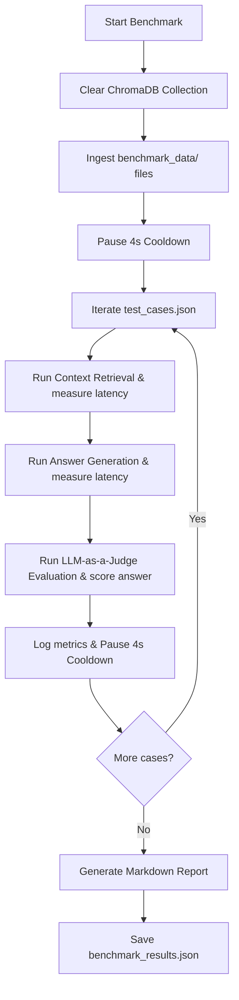

# Multi-Modal RAG Pipeline Benchmark Design Specification

This document details the design and execution strategy for benchmarking the local Multi-Modal RAG pipeline in the `ai-chat` project.

---

## 1. Objectives & Scope
The benchmark is designed to run entirely locally, evaluating both **Performance** (latency, token consumption) and **Retrieval/Response Quality** (source precision/recall, answer semantic correctness).

Specifically, it measures:
1. **Ingestion Performance:** Time to parse files, extract tables/images, generate captions, and index them into ChromaDB.
2. **Retrieval Latency:** Time to embed queries and match relevant chunks in ChromaDB.
3. **Generation Latency:** Time for Gemini to synthesize a response based on context text and hydrated PIL image assets.
4. **Token Usage:** Input and output token metrics from the Gemini API.
5. **Quality Metrics:** Source file/content-type precision and recall, and final answer semantic similarity score (using an LLM-as-a-judge).

---

## 2. Architecture & File Layout

All benchmarking code, configuration, and sample files are isolated to prevent interference with production application logic.

```
ai-chat/
├── benchmark.py                 # Main benchmark execution and reporting script
├── benchmark_data/              # Isolated benchmark dataset directory
│   ├── test_cases.json          # Predefined queries and expected ground truth
│   ├── sample_doc.pdf           # Sample multi-page PDF with tables/diagrams
│   ├── sample_image.png         # Standalone diagram
│   └── sample_text.txt          # Plain text description
```

---

## 3. Benchmark Data & Schema

### `test_cases.json` Schema
The evaluation dataset contains test cases targeting different components of the multi-modal pipeline:

```json
[
  {
    "id": "TC_001",
    "query": "What is the key architecture component described in Figure 1?",
    "expected_sources": ["sample_doc.pdf"],
    "expected_content_types": ["image_caption"],
    "reference_answer": "The key component is the distributed query planner coordinating worker nodes.",
    "category": "multimodal_image"
  },
  {
    "id": "TC_002",
    "query": "According to the summary table, what is the database throughput?",
    "expected_sources": ["sample_doc.pdf"],
    "expected_content_types": ["table"],
    "reference_answer": "The average database throughput is 15,400 requests per second.",
    "category": "table_extraction"
  },
  {
    "id": "TC_003",
    "query": "What does the text document list as the primary system requirements?",
    "expected_sources": ["sample_text.txt"],
    "expected_content_types": ["text"],
    "reference_answer": "The primary requirements are Python 3.12+, 16GB RAM, and a valid Google API key.",
    "category": "text_retrieval"
  }
]
```

---

## 4. Execution Flow & Free-Tier Rate-Limit Protection

Since the target environment uses a **Free Tier Gemini API Key** (limited to **15 Requests Per Minute (RPM)**), the execution loop is designed to throttle itself naturally.



### Free-Tier Throttling & Cooldowns:
1. **Between Operations:** A mandatory sleep of `4.0` seconds is introduced after every API call (embedding generation, answer generation, and LLM evaluation) to keep overall RPM below 15.
2. **Robust Exponential Retry:** All API requests use backoff retry with the following parameters:
   - `max_retries`: 5
   - `initial_delay`: 2.0s
   - `multiplier`: 2.0 (delay doubles each retry: 2s, 4s, 8s, 16s, 32s)

---

## 5. Metrics & Evaluation Criteria

### Performance & Telemetry Metrics
* **Ingestion Time:** Elapsed wall-clock time for parser ingestion and indexing.
* **Retrieval Latency:** Time to embed query and run ChromaDB match.
* **Generation Latency:** Time to run LLM inference.
* **Token Metrics:** Raw `input_token_count` and `candidates_token_count` extracted from `response.usage_metadata`.

### Quality & Accuracy Metrics
* **Source Precision:** $\frac{|Retrieved\ Chunks\ with\ Expected\ Source|}{|All\ Retrieved\ Chunks|}$
* **Source Recall:** $\frac{|Retrieved\ Chunks\ with\ Expected\ Source\ and\ Content\ Type|}{|Expected\ Source\ and\ Content\ Type\ combinations|}$
* **Semantic Similarity Score (LLM-as-a-Judge):**
  A separate call to `gemini-3.1-flash-lite` evaluates the semantic correctness of the generated answer compared to the reference answer.
  
  *Evaluation Prompt:*
  > Compare the candidate response to the ground-truth reference answer for correctness and completeness. Rate the correctness on a scale from 0.0 (completely incorrect) to 1.0 (perfectly correct and complete). Output only a floating-point number.

---

## 6. Trade-off Analysis

* **LLM-as-a-Judge vs. Token-based Metrics (e.g. BLEU/ROUGE):**
  - *BLEU/ROUGE:* Low token cost, but fails on semantic equivalence (e.g. if the LLM paraphrases the answer using different words, BLEU score drops).
  - *LLM-as-a-Judge:* Higher token cost, but captures semantic correctness accurately. Since we have added 4s cooldowns and retries, LLM-as-a-judge is preferred for precision.
* **ChromaDB Clean State vs. Append State:**
  - The database is completely cleared before the benchmark starts to prevent bleeding context from previous application usage, ensuring a deterministic and reproducible evaluation.
