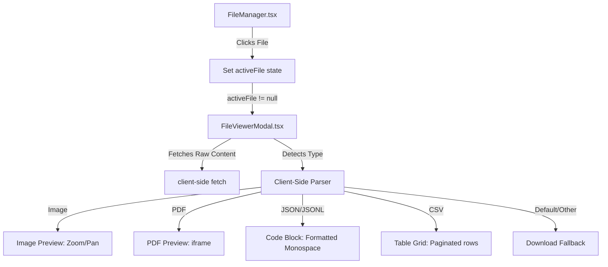

# Design Specification: Client-Side File Viewer Modal

## 1. Goal & Context
Currently, users of the EvalPlatform dashboard can upload file assets (such as datasets, images, PDFs, etc.) in the `FileManager` side panel. However, clicking a file simply attempts to open its raw URL in a new tab, which often returns a 404 due to local development URL mismatches, or fails to provide a unified in-app preview experience.

This specification designs a focused **centered modal file viewer** that allows users to preview files directly within the dashboard.

---

## 2. Architecture & Components



### Component Details
1. **`FileViewerModal.tsx`**: A new React dialog component utilizing Radix UI primitives (`@/components/ui/dialog`) to display a centered, backdrop-darkened overlay.
2. **`FileManager.tsx`**: Updated to contain local state:
   ```typescript
   const [activeFile, setActiveFile] = useState<FileAsset | null>(null);
   ```
   When a file is clicked, `activeFile` is set, displaying the modal.

---

## 3. Logic Flow & Content Parsing

### A. URL Resolution Helper
To bridge the backend path mismatch (`/api/v1/...` in URL payload vs `/v1/...` actual FastAPI endpoint), we implement a helper in `lib/api/datasets.ts` or `lib/utils.ts`:
```typescript
export function getAbsoluteFileUrl(url: string): string {
  if (!url) return "";
  if (url.startsWith("http://") || url.startsWith("https://")) return url;
  
  const apiBase = process.env.NEXT_PUBLIC_API_URL || "http://localhost:8000";
  let path = url;
  if (path.startsWith("/api/v1/")) {
    path = path.replace("/api/v1/", "/v1/");
  }
  return `${apiBase}${path.startsWith("/") ? "" : "/"}${path}`;
}
```

### B. Client-side Parsing Rules
When the modal opens, it retrieves the absolute URL. If the file is a text-based format (CSV, JSON, JSONL, TXT, MD), it fetches the content as plain text:

* **CSV Parser**: 
  * Parses row-by-row using newlines and commas (respecting simple quote escaping).
  * Renders a styled CSS tabular grid (`<table>` element) displaying headers and the first 100 rows.
* **JSON / JSONL Parser**:
  * For standard JSON, attempts to parse and print nicely formatted text: `JSON.stringify(JSON.parse(text), null, 2)`.
  * For JSONL, splits by line and formats each line as a JSON object block.
* **Images**:
  * Renders using an `` with max width and zoom capability.
* **PDFs**:
  * Renders within an `<iframe src={absoluteUrl} />` tag.
* **Audios/Videos**:
  * Renders with custom `<audio controls>` or `<video controls>` tags.

### C. Truncation and Size Restrictions
* **Files > 1MB or > 1,000 lines**: 
  * The frontend only fetches/slices the first 1,000 lines.
  * Displays an Amber Warning Banner: *"Large File: Showing the first 1,000 lines to protect performance. Download the full file to see everything."*

---

## 4. Metadata & Actions Panel (Right Sidebar)
The right 25% of the modal displays metadata and actions:
* **File Name & ID**: Quick copy button for the ID and Markdown file reference (e.g. `{{file:f_abc123}}`).
* **Format & Size**: Extracted and formatted details.
* **Primary Actions**:
  * **Download**: Downloads the full file from the backend.
  * **Delete**: Triggers deletion through the datasets delete API with a confirmation prompt.

---

## 5. Architectural Trade-off
* **Client-Side Parsing vs. Server-Side Preview API**:
  * **Selected Option**: Client-Side Parsing. 
  * **Trade-off**: The frontend has to parse CSVs and JSONL itself. However, this saves us from modifying the backend schema, avoids duplicate data transfers, and is faster for files under 2MB. Since we are already truncating large files at 1MB, performance remains high.
