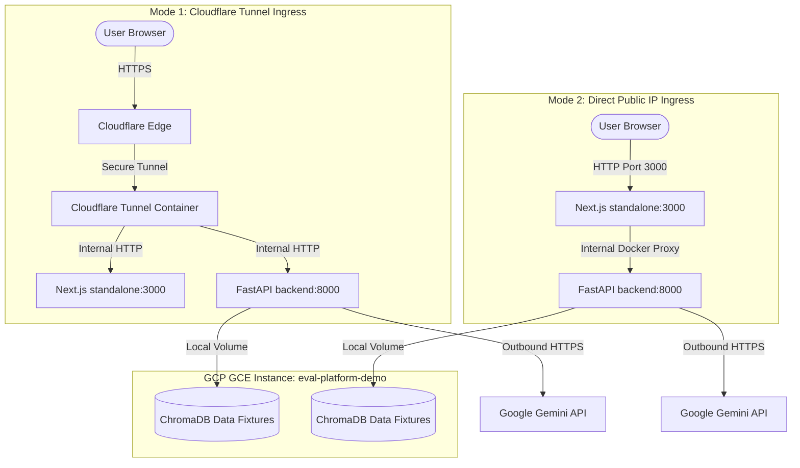

# Design Spec: GCP Deployment Plan for EvalPlatform

**Date:** 2026-06-25  
**Status:** APPROVED  
**Agent:** DevOps Engineer Specialist

---

## 1. Executive Summary

This specification outlines the architecture, resources, and procedures required to deploy the **EvalPlatform** monorepo to Google Cloud Platform (GCP) for a demo environment.

To accommodate different environments, the design supports two deployment modes:
1. **Cloudflare Tunnel Mode (Production/Secure):** Routes ingress traffic securely through a Cloudflare Tunnel container. Requires no open public HTTP/S ports on the GCE instance.
2. **Direct Public IP Mode (Free/Quick Demo):** Opens ports `3000` (Frontend) and `8000` (Backend API) on the GCE firewall. Allows rapid testing using the VM's public IP without a domain name.

---

## 2. System Architecture



### Components
1. **Cloudflare Tunnel Client Container (`tunnel`):** Established outbound connection to Cloudflare. Runs conditionally only if a tunnel token is provided.
2. **Frontend Container (`frontend`):** Standalone Next.js 16 Web Dashboard serving the metrics UI. Internally proxies `/api/*` to `http://backend:8000/*` to resolve hairpin NAT routing and CORS issues.
3. **Backend Container (`backend`):** FastAPI app managing telemetry ingestion, session tracking, and evaluations.
4. **Data Persistence (`ChromaDB`):** Persistent local directory bind-mounted on the GCE boot disk (`/home/ubuntu/eval-platform/data/fixtures`).

---

## 3. Infrastructure Provisioning (Terraform)

Infrastructure is managed via Terraform located in `terraform/`.

### Resource Manifest
* **Provider:** `hashicorp/google`
* **VPC Network:** `google_compute_network.eval_vpc`
  * Custom network named `eval-platform-vpc` with `auto_create_subnetworks = true` to avoid relying on a default project network.
* **VM Instance:** `google_compute_instance.eval_vm`
  * **Machine Type:** `e2-medium` (2 vCPUs, 4 GB Memory)
  * **OS Disk:** 30 GB PD-Balanced, Ubuntu 22.04 LTS Minimal
  * **Network:** Connected to the custom `eval-platform-vpc` network with ephemeral external IP
* **Firewall Rule:** `google_compute_firewall.allow_ssh`
  * Allows TCP ports `22` (SSH), `3000` (Frontend), and `8000` (Backend API) on the custom VPC.
* **Service Account:** `google_service_account.eval_sa`
  * Dedicated service account with minimal IAM execution roles.

### GCE Metadata Key Injections
Terraform injects application secrets into GCE Instance Metadata:
- `google_api_key`
- `cloudflare_tunnel_token` (Optional: set to `""` for Direct IP mode)
- `next_public_api_url` (Optional: set to `""` or `"/api"` for Direct IP mode to trigger Next.js reverse proxy)

---

## 4. Automation & Bootstrap Scripts

A startup shell script is injected via GCE instance metadata to automate VM setup upon boot.

### GCE Startup Script (`terraform/scripts/startup.sh`)
```bash
#!/bin/bash
# GCP GCE Startup Script
set -e

echo "=== System Update and Dependencies ==="
apt-get update && apt-get upgrade -y
apt-get install -y curl git apt-transport-https ca-certificates gnupg lsb-release

# Install Docker Engine
echo "=== Installing Docker ==="
mkdir -p /etc/apt/keyrings
curl -fsSL https://download.docker.com/linux/ubuntu/gpg | gpg --dearmor -o /etc/apt/keyrings/docker.gpg
echo \
  "deb [arch=$(dpkg --print-architecture) signed-by=/etc/apt/keyrings/docker.gpg] https://download.docker.com/linux/ubuntu \
  $(lsb_release -cs) stable" | tee /etc/apt/sources.list.d/docker.list > /dev/null
apt-get update
apt-get install -y docker-ce docker-ce-cli containerd.io docker-compose-plugin

# Query GCP Metadata Server for application secrets
echo "=== Loading Secrets from Metadata Server ==="
METADATA_URL="http://metadata.google.internal/computeMetadata/v1/instance/attributes"
GOOGLE_API_KEY=$(curl -H "Metadata-Flavor: Google" "$METADATA_URL/google_api_key")
CLOUDFLARE_TUNNEL_TOKEN=$(curl -H "Metadata-Flavor: Google" "$METADATA_URL/cloudflare_tunnel_token")
NEXT_PUBLIC_API_URL=$(curl -H "Metadata-Flavor: Google" "$METADATA_URL/next_public_api_url")

# Automatically set relative API path if NEXT_PUBLIC_API_URL is empty (triggers Next.js reverse proxy)
if [ -z "$NEXT_PUBLIC_API_URL" ]; then
  echo "NEXT_PUBLIC_API_URL is empty. Setting to relative path /api to utilize Next.js API proxy."
  NEXT_PUBLIC_API_URL="/api"
fi

# Setup App Directory
cd /home/ubuntu
if [ ! -d "eval-platform" ]; then
  echo "=== Cloning Repository ==="
  git clone https://github.com/your-username/eval-platform.git
fi
cd eval-platform

# Generate Production .env File
echo "=== Creating .env ==="
cat <<EOF > .env
GOOGLE_API_KEY=$GOOGLE_API_KEY
CLOUDFLARE_TUNNEL_TOKEN=$CLOUDFLARE_TUNNEL_TOKEN
NEXT_PUBLIC_API_URL=$NEXT_PUBLIC_API_URL
EOF
chmod 600 .env

# Create Database Volume Path and seed default metrics/prompts
echo "=== Seeding default metrics and prompts to persistent volume ==="
mkdir -p data/fixtures
cp -r backend/fixtures/default_metrics data/fixtures/
cp -r backend/fixtures/prompts data/fixtures/
chown -R ubuntu:ubuntu /home/ubuntu/eval-platform

# Spin Up Containers
echo "=== Launching Docker Compose Workloads ==="
if [ -z "$CLOUDFLARE_TUNNEL_TOKEN" ]; then
  echo "No Cloudflare Tunnel Token detected. Running in Direct IP mode (excluding tunnel)."
  docker compose -f docker-compose.yml -f docker-compose.prod.yml up --build -d backend frontend
else
  echo "Cloudflare Tunnel Token detected. Running all services including tunnel."
  docker compose -f docker-compose.yml -f docker-compose.prod.yml up --build -d
fi

echo "=== Deployment Successfully Completed ==="
```

---

## 5. Deployment Runbook

### Pre-requisites
1. **GCP Project:** Set up a billing-enabled GCP project and install/initialize the `gcloud` CLI tool locally.
2. **Google Gemini API Key:** Obtain an API key for the LLM evaluation engine.

---

### Path A: Deploying via Direct Public IP (Free, No Domain)

#### Step 1: Provision the Infrastructure
1. Go to the `terraform/` folder in your local repository.
2. Create `terraform/terraform.tfvars`:
   ```hcl
   project_id              = "your-gcp-project-id"
   google_api_key          = "AIzaSy..."
   # cloudflare_tunnel_token and next_public_api_url are omitted or set to ""
   ```
3. Run Terraform to spin up the VPC network, firewall, and GCE instance:
   ```bash
   terraform init
   terraform apply
   ```

#### Step 2: Access the Application
The GCE startup script will automatically configure Next.js to use the internal reverse proxy to resolve API calls, keeping it safe and fully automated.
1. Note the output `vm_external_ip` from the Terraform output in your terminal (e.g. `34.120.10.11`).
2. Wait 2-3 minutes for the VM setup to complete.
3. Open `http://34.120.10.11:3000` in your web browser.

---

### Path B: Deploying via Cloudflare Tunnel (Secure Custom Domain)

#### Step 1: Configure DNS & Routing in Cloudflare
Add public hostname mappings in your Cloudflare Tunnel dashboard:
* `eval.yourdomain.com` -> `http://frontend:3000`
* `eval-api.yourdomain.com` -> `http://backend:8000`

#### Step 2: Configure variables and run Terraform
Create `terraform/terraform.tfvars`:
```hcl
project_id              = "your-gcp-project-id"
google_api_key          = "AIzaSy..."
cloudflare_tunnel_token = "eyJhbGciOiJ..." # Copy the token shown in the Cloudflare Setup screen
next_public_api_url     = "https://eval-api.yourdomain.com"
```

Apply the configurations to provision the GCP resources:
```bash
terraform init
terraform apply
```

#### Step 3: Access
The VM will automatically connect to Cloudflare. Click **Next** on the Cloudflare website and open `https://eval.yourdomain.com` in your browser.

---

## 6. Rollback & Maintenance Plan

### Code Updates / Redeployment
To deploy updates manually on the GCE VM:
```bash
ssh ubuntu@<vm-external-ip>
cd eval-platform
git pull origin main
docker compose -f docker-compose.yml -f docker-compose.prod.yml up --build -d
```

### Rollback Strategy
If a deployment fails:
1. Revert to the last stable git commit on the VM:
   ```bash
   git checkout <stable-commit-hash>
   docker compose -f docker-compose.yml -f docker-compose.prod.yml up --build -d
   ```
2. If the VM itself is degraded or misconfigured, tear it down and reprovision via Terraform:
   ```bash
   terraform destroy -auto-approve
   terraform apply -auto-approve
   ```
