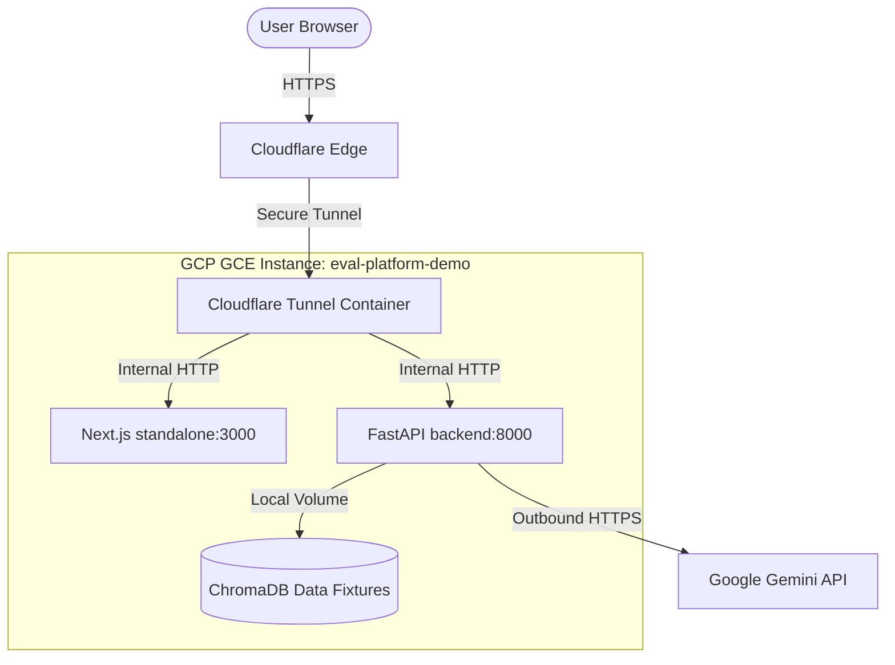

# Design Spec: GCP Deployment Plan for EvalPlatform

**Date:** 2026-06-25  
**Status:** DRAFT (Awaiting Final User Review)  
**Agent:** DevOps Engineer Specialist

---

## 1. Executive Summary

This specification outlines the architecture, resources, and procedures required to deploy the **EvalPlatform** monorepo to Google Cloud Platform (GCP) for a demo environment. 

To ensure security, simplicity, and ease of management, the infrastructure is provisioned using **Terraform**, runs containerized workloads via **Docker Compose**, and leverages a **Cloudflare Tunnel** for ingress, eliminating the need to expose public ports on the VM.

---

## 2. System Architecture



### Components
1. **Cloudflare Tunnel Client Container (`tunnel`):** Established outbound connection to Cloudflare. Securely proxy incoming web requests to the correct services on the local Docker network without inbound firewall rules on GCP.
2. **Frontend Container (`frontend`):** Standalone Next.js 16 Web Dashboard serving the metrics UI.
3. **Backend Container (`backend`):** FastAPI app managing telemetry ingestion, session tracking, and evaluations.
4. **Data Persistence (`ChromaDB`):** Persistent local directory bind-mounted on the GCE boot disk (`/home/ubuntu/eval-platform/data/fixtures`).

---

## 3. Infrastructure Provisioning (Terraform)

Infrastructure will be managed via Terraform located in `terraform/`.

### Resource Manifest
* **Provider:** `hashicorp/google`
* **VM Instance:** `google_compute_instance.eval_vm`
  * **Machine Type:** `e2-medium` (2 vCPUs, 4 GB Memory)
  * **OS Disk:** 30 GB PD-Balanced, Ubuntu 22.04 LTS Minimal
  * **Network:** Default network with ephemeral external IP (no static IP charge)
* **Firewall Rule:** `google_compute_firewall.allow_ssh`
  * Allows TCP port 22 (SSH) for administrative operations.
  * Inbound ports 80 (HTTP) and 443 (HTTPS) are blocked (ingress handled by tunnel).
* **Service Account:** `google_service_account.eval_sa`
  * Dedicated service account with minimal IAM execution roles.

### GCE Metadata Key Injections
Terraform injects application secrets into GCE Instance Metadata:
- `google_api_key`
- `cloudflare_tunnel_token`
- `next_public_api_url`

---

## 4. Automation & Bootstrap Scripts

A startup shell script is injected via GCE instance metadata to automate VM setup upon boot.

### GCE Startup Script (`terraform/scripts/startup.sh`)
```bash
#!/bin/bash
set -e

echo "=== System Package Update ==="
apt-get update && apt-get upgrade -y
apt-get install -y curl git apt-transport-https ca-certificates gnupg lsb-release

# Install Docker
echo "=== Installing Docker ==="
mkdir -p /etc/apt/keyrings
curl -fsSL https://download.docker.com/linux/ubuntu/gpg | gpg --dearmor -o /etc/apt/keyrings/docker.gpg
echo \
  "deb [arch=$(dpkg --print-architecture) signed-by=/etc/apt/keyrings/docker.gpg] https://download.docker.com/linux/ubuntu \
  $(lsb_release -cs) stable" | tee /etc/apt/sources.list.d/docker.list > /dev/null
apt-get update
apt-get install -y docker-ce docker-ce-cli containerd.io docker-compose-plugin

# Get metadata variables from GCP Metadata Server
echo "=== Retrieving Environment Configurations from Metadata Server ==="
METADATA_URL="http://metadata.google.internal/computeMetadata/v1/instance/attributes"
GOOGLE_API_KEY=$(curl -H "Metadata-Flavor: Google" "$METADATA_URL/google_api_key")
CLOUDFLARE_TUNNEL_TOKEN=$(curl -H "Metadata-Flavor: Google" "$METADATA_URL/cloudflare_tunnel_token")
NEXT_PUBLIC_API_URL=$(curl -H "Metadata-Flavor: Google" "$METADATA_URL/next_public_api_url")

# Setup project directory
cd /home/ubuntu
if [ ! -d "eval-platform" ]; then
  echo "=== Cloning Repository ==="
  git clone https://github.com/your-username/eval-platform.git
fi
cd eval-platform

# Write environment secrets
echo "=== Creating .env Configuration ==="
cat <<EOF > .env
GOOGLE_API_KEY=$GOOGLE_API_KEY
CLOUDFLARE_TUNNEL_TOKEN=$CLOUDFLARE_TUNNEL_TOKEN
NEXT_PUBLIC_API_URL=$NEXT_PUBLIC_API_URL
EOF
chmod 600 .env
mkdir -p data/fixtures
chown -R ubuntu:ubuntu /home/ubuntu/eval-platform

# Run Production Containers
echo "=== Launching Production Services ==="
docker compose -f docker-compose.yml -f docker-compose.prod.yml up --build -d

echo "=== Startup Script Completed ==="
```

---

## 5. Deployment Runbook

### Pre-requisites
1. **Cloudflare Zero Trust account:** Access dashboard and create a new Cloudflare Tunnel. Retrieve the `CLOUDFLARE_TUNNEL_TOKEN`.
2. **GCP Project:** Set up a billing-enabled GCP project and install/initialize the `gcloud` CLI tool locally.
3. **Google Gemini API Key:** Obtain an API key for the LLM evaluation engine.

### Deployment Step-by-Step

#### Step 1: Configure DNS & Routing in Cloudflare
Add public hostname mappings in your Cloudflare Tunnel dashboard:
* `eval.yourdomain.com` -> `http://frontend:3000`
* `eval-api.yourdomain.com` -> `http://backend:8000`

#### Step 2: Initialize & Configure Terraform
Create a local variables file `terraform/terraform.tfvars`:
```hcl
project_id              = "your-gcp-project-id"
google_api_key          = "AIzaSy..."
cloudflare_tunnel_token = "ey..."
next_public_api_url     = "https://eval-api.yourdomain.com"
```

Apply the Terraform configurations to provision GCE VM:
```bash
cd terraform
terraform init
terraform plan -out=tfplan
terraform apply tfplan
```

#### Step 3: Deployment Verification
1. GCE VM creation triggers the startup script automatically.
2. Watch the startup script logs by SSHing into the VM and running:
   ```bash
   sudo tail -f /var/log/syslog | grep startup-script
   ```
3. Verify containers are running healthy:
   ```bash
   docker compose ps
   ```
4. Access `https://eval.yourdomain.com` in your browser.

---

## 6. Rollback & Maintenance Plan

### Code Updates / Redeployment
To deploy updates manually on the GCE VM:
```bash
ssh ubuntu@<vm-external-ip>
cd eval-platform
git pull origin main
docker compose -f docker-compose.yml -f docker-compose.prod.yml up --build -d
```

### Rollback Strategy
If a deployment fails:
1. Revert to the last stable git commit on the VM:
   ```bash
   git checkout <stable-commit-hash>
   docker compose -f docker-compose.yml -f docker-compose.prod.yml up --build -d
   ```
2. If the VM itself is degraded or misconfigured, tear it down and reprovision via Terraform:
   ```bash
   terraform destroy -auto-approve
   terraform apply -auto-approve
   ```
