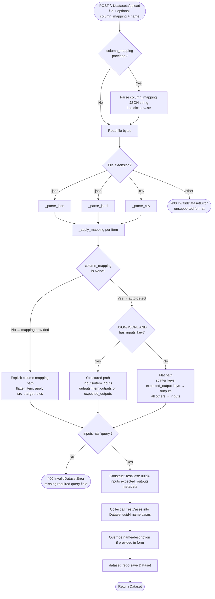

# Report: TestCase Schema & Dataset Parsers

---

## Part 1 — TestCase Schema

### Core Entities

The evaluation system operates on two nested entities: `Dataset` wraps a list of `TestCase` objects.

```
Dataset
├── id          UUID           unique identifier
├── name        str            human-readable label (defaults to uploaded filename)
├── description str | None     optional description
├── schema      dict           human-readable field documentation (not enforced at runtime)
└── cases       list[TestCase]

  TestCase
  ├── id                UUID       unique identifier per case
  ├── inputs            dict       free-form key/value inputs to the AI under test
  ├── expected_outputs  dict       ground-truth expected results
  └── metadata          dict       arbitrary extra data (tags, difficulty, etc.)
```

Both are Python `@dataclass` objects in `core/eval_engine/models.py`. They are serialised to **JSON** for persistence.

---

### The `inputs` bag — what goes in

`inputs` is a free-form `dict[str, Any]`. The only **mandatory** key is `query` — the primary user input. All other keys are optional and application-specific.

| Key | Required | Type | Meaning |
|-----|----------|------|---------|
| `query` | ✅ | `str` | The question or prompt sent to the AI |
| `image_id` | optional | `str` | Reference ID of a file uploaded via `POST /datasets/{id}/files` |
| `*` | optional | `Any` | Any additional context the metric might need (e.g. `document_id`, `chat_history`) |

---

### The `expected_outputs` bag

`expected_outputs` is also a free-form `dict[str, Any]`. The conventional key is `expected_output` (singular string). The parser normalises several common variants to this key:

| Source field name | Normalised to |
|-------------------|--------------|
| `expected_output` | `expected_output` |
| `expected_outputs` | `expected_output` |
| `output` | `expected_output` |

If no expected output is provided, the dict is simply empty — useful for exploratory datasets where you only care about metric scores, not comparison to ground truth.

---

### The `schema` field — documentation, not validation

`schema` is a plain `dict` attached to the `Dataset` entity. It is **not enforced at runtime**. It is a human-readable field guide meant to communicate the dataset's structure to users and agents.

**Conventional structure:**
```json
{
  "inputs": {
    "query": "string (Required: the main user input)",
    "image_id": "string (Optional: ID of an uploaded image)"
  },
  "outputs": {
    "expected_output": "string (Optional: the ideal response)"
  }
}
```

The schema is stored alongside the dataset in JSON and returned in API responses so the frontend can display field hints when users create testcases manually.

---

### Persisted JSON format — real example

```json
{
  "id": "93aab9db-1919-4478-a718-fbdd1a004b6a",
  "name": "InvoiceGolden",
  "schema": {
    "inputs": {
      "query": "string (Required: the main user input)",
      "image_id": "string (Optional: ID of an uploaded image)"
    },
    "outputs": {
      "expected_output": "string (Optional: the ideal response)"
    }
  },
  "cases": [
    {
      "id": "3a341de9-7353-4b7a-a8a5-265d6c413ca7",
      "inputs": {
        "query": "When was the invoice issued?",
        "image_id": "f_601831b734bc4d95afddd1101af7b074.jpg"
      },
      "expected_outputs": {
        "expected_output": "2013-04-13"
      },
      "metadata": {}
    }
  ]
}
```

Each `Dataset` is stored as a single flat JSON file at `fixtures/datasets/{uuid}.json`. All cases are embedded inline — there is no separate case-level storage.

---

### Dataset file attachments

Files referenced by `image_id` (or similar) are stored separately under `fixtures/dataset_files/{dataset_id}/`. Each file gets:
- A generated ID: `f_{uuid_hex}.{ext}` (e.g. `f_601831b734bc4d95afddd1101af7b074.jpg`)
- A sidecar metadata file: `f_...jpg.meta.json` containing the original filename

The `image_id` in a testcase's `inputs` is this generated filename, served back via `GET /v1/datasets/{id}/files/{file_id}`.

---

---

## Part 2 — TestCase & Dataset Parsers

### Overview

The `DatasetParserService` converts raw uploaded file bytes into a `Dataset` entity populated with `TestCase` objects. It handles three file formats and two resolution strategies (default auto-detection and explicit column mapping).

---

### Upload flow (end-to-end)



---

### Three format parsers

#### JSON parser (`_parse_json`)
- Expects a JSON **array** at the top level. Rejects scalars or objects.
- Iterates each element, calls `_apply_mapping`, validates `query` presence, emits a `TestCase`.
- The entire file is loaded into memory at once (`json.loads`).

#### JSONL parser (`_parse_jsonl`)
- Reads line-by-line. Empty lines are silently skipped.
- Each line must be a valid JSON **object**. Malformed lines raise `InvalidDatasetError` with the line number.
- Reports error position: `"Invalid JSON at line 7"`.

#### CSV parser (`_parse_csv`)
- Uses `csv.DictReader` — column headers become the dict keys.
- Always uses the flat resolution path (no nested structure possible in CSV).
- All columns that are not `expected_output / expected_outputs / output` are treated as inputs.

---

### Two resolution paths inside `_apply_mapping`

#### Path A — No `column_mapping` (auto-detect)

The parser inspects the shape of each record:

| Condition | Behaviour |
|-----------|-----------|
| JSON/JSONL **and** record has an `inputs` key | **Structured**: `inputs = item['inputs']`, `outputs = item['outputs']` or `item['expected_outputs']`, `metadata = item['metadata']` |
| CSV **or** record has no `inputs` key | **Flat scatter**: any key matching `expected_output / expected_outputs / output` → `outputs['expected_output']`; all other keys → `inputs` |

#### Path B — `column_mapping` provided (explicit)

The user supplies a `dict[str, str]` mapping source field paths to target locations. The record is first flattened (nested dicts become `parent.child` dot-keys). Then each source key is routed:

| Target prefix | Destination |
|---------------|------------|
| `query` | `inputs['query']` |
| `expected_output` | `outputs['expected_output']` |
| `inputs.<key>` | `inputs[key]` |
| `expected_outputs.<key>` | `outputs[key]` |
| `metadata.<key>` | `metadata[key]` |
| *(unmapped key)* | `inputs[key]` (default bucket) |

**Example mapping:**
```json
{
  "question": "query",
  "ground_truth": "expected_output",
  "difficulty": "metadata.difficulty"
}
```

This lets users bring in arbitrary third-party datasets without reformatting them.

---

### Manual testcase management (non-upload path)

Beyond file upload, testcases can be managed individually via CRUD endpoints:

| Operation | Endpoint | Behaviour |
|-----------|---------|-----------|
| Create | `POST /datasets/{id}/cases` | Appends a new `TestCase` to the existing `Dataset`, re-saves the whole file |
| List | `GET /datasets/{id}/cases` | Returns paginated slice (`page`, `limit`) of `dataset.cases` |
| Update | `PUT /datasets/{id}/cases/{case_id}` | Full replace — finds by ID in the list, swaps, re-saves |
| Delete | `DELETE /datasets/{id}/cases/{case_id}` | Filters the case out, re-saves; 404 if not found |

All mutations re-save the entire `Dataset` JSON. Because cases are stored inline (not in separate files), every write rewrites all cases.

---

### Validation summary

| Rule | Enforced where | Error |
|------|---------------|-------|
| File format must be `.json`, `.jsonl`, or `.csv` | `DatasetParserService.parse` | `400 InvalidDatasetError` |
| Top-level must be a JSON array (not object) | `_parse_json` | `400 InvalidDatasetError` |
| Each JSONL line must be a JSON object | `_parse_jsonl` | `400 InvalidDatasetError` with line number |
| Every resolved `inputs` must contain `query` | All parsers, post `_apply_mapping` | `400 InvalidDatasetError` |
| `column_mapping` must be valid JSON object | `upload_dataset` endpoint | `400 HTTPException` |

> [!NOTE]
> The `query` field is the only enforced schema contract across all formats. All other fields (`expected_output`, additional inputs, metadata) are optional. This keeps the parser format-agnostic while still providing a minimal anchor for evaluation routing.

> [!WARNING]
> Because the entire `Dataset` (including all embedded `TestCase` objects) is re-written on every mutation, large datasets with thousands of cases will produce large JSON write operations on every individual testcase add/update/delete. This is a known trade-off of the file-based storage approach.
