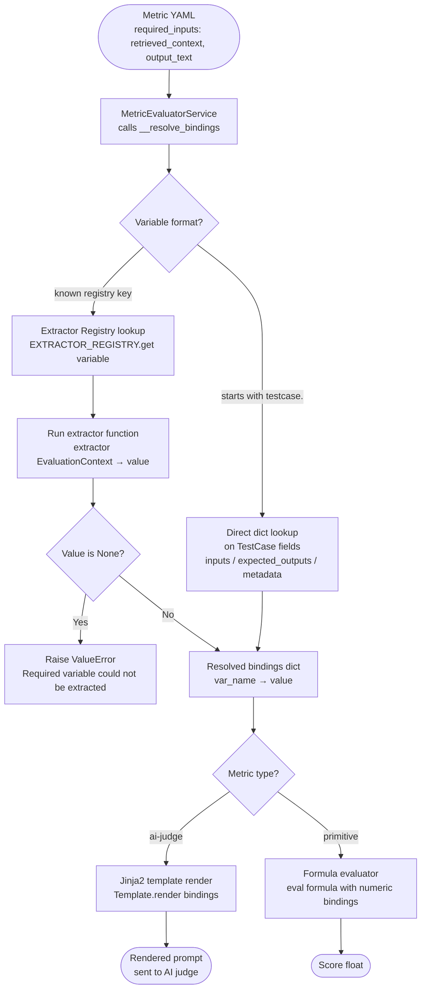
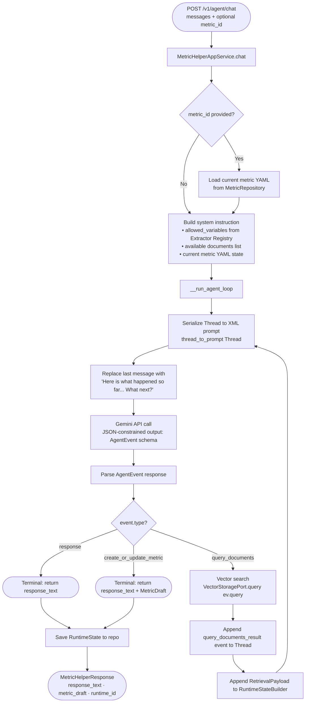

# Report: Variable Parser & Metric Builder Agent Loop

---

## Part 1 — Variable Parser Workflow

### Overview

The Variable Parser is the bridge between a **Metric config** (which declares what it needs, e.g. `retrieved_context`) and the actual **runtime data** inside a `RuntimeState`. The user never maps variables manually — the system resolves them automatically.

---

### Step-by-step workflow



---

### The Extractor Registry

The registry is a plain `dict` populated at module load time using the `@extractor('variable_name')` decorator. Every decorated function is automatically registered — no manual wiring needed.

```
EXTRACTOR_REGISTRY = {
  'input_text'         → reads last GenerationPayload.input_text
  'output_text'        → reads last GenerationPayload.output_text
  'retrieved_context'  → formats all RetrievalPayload chunks into ranked document blocks
  'latency_ms'         → sums resource_usage.latency_ms across all runtime states
  'ocr_latency_ms'     → finds the FileProcessedPayload where processor == 'ocr'
}
```

Adding a new variable requires only one thing: a new `@extractor('my_var')` decorated function in the extractor file. The system picks it up automatically.

---

### Two resolution paths

| Path | Trigger | Mechanism |
|------|---------|-----------|
| **Registry lookup** | Any known variable name (e.g. `retrieved_context`) | Call the registered function with the `EvaluationContext` |
| **Dynamic testcase lookup** | Variable starts with `testcase.` (e.g. `testcase.inputs.image_url`) | Parse the dotted path, walk into `TestCase.inputs / expected_outputs / metadata` dict |

The dynamic `testcase.*` path means metrics can reference arbitrary testcase fields without any code change — only the YAML `required_inputs` declaration changes.

---

### `retrieved_context` extractor — detailed behaviour

This is the most complex extractor. It handles two sources:

1. **Primary** — `RetrievalPayload` events in the runtime: iterates all retrieval events, formats each chunk as `--- Document N (Source: X, Confidence: Y) ---\ntext`. If retrieval events exist but produced no chunks, returns `"No relevant documents found."`.
2. **Fallback** — if no retrieval events exist at all, looks for `retrieved_context` inside `state.metadata` (allows manual injection without SDK instrumentation).

---

### Where variable resolution feeds back into evaluation

After `__resolve_bindings` returns the resolved dict:

- **`ai-judge` path**: The dict is passed to `__format_prompt`, which renders the Jinja2 `prompt_template`. Dot-notation keys (e.g. `testcase.inputs.text`) are unflattened into nested dicts so Jinja can resolve them naturally.
- **`primitive` path**: The dict values are cast to `float` and passed directly to the `FormulaEvaluatorService`, which evaluates the Python expression string (e.g. `latency_ms / 1000`).

---

---

## Part 2 — Metric Builder Agent Loop

### Overview

The Metric Builder is a conversational agent backed by Gemini. The user describes a metric in natural language; the agent decides autonomously what to do next, optionally retrieves reference documents from ChromaDB, and eventually emits a structured `MetricDraft`.

The core mechanic is an **agentic loop**: on each turn, instead of a plain text response, the model outputs a typed `AgentEvent` JSON object declaring its next action. The loop continues until the model emits a terminal action (`response` or `create_or_update_metric`).

---

### Step-by-step loop



---

### Agent events (the typed action vocabulary)

On every loop iteration, the model must output exactly one of these event types:

| Event type | Meaning | Terminal? | Required fields |
|------------|---------|-----------|-----------------|
| `user_message` | (seed only) — the user's raw input | — | `query` |
| `query_documents` | Agent wants to search the vector store | ❌ Loop continues | `query` |
| `query_documents_result` | Result injected back into the thread | — | `query_result` |
| `response` | Agent is done — plain conversational reply | ✅ | `response` |
| `create_or_update_metric` | Agent is done — emits a metric draft | ✅ | `response` + `metric_draft` |

---

### The Thread as working memory

The `Thread` is the agent's scratchpad. It accumulates all events across loop iterations and is serialised to XML at the start of every step:

```xml
<user_message>
How do I evaluate faithfulness of my RAG app?
</user_message>

<query_documents>
faithfulness RAG evaluation criteria
</query_documents>

<query_documents_result>
--- Document 1 (Source: faithfulness_guide.pdf, Confidence: 0.9231) ---
Faithfulness measures whether the generated answer is grounded in the retrieved context...
</query_documents_result>
```

The model receives this thread alongside the full conversation history and answers: **"What's the next step?"** — forcing it to reason about what remains to be done.

---

### System instruction construction

Before the loop starts, the system instruction is assembled dynamically from three sources:

| Block | Content | Purpose |
|-------|---------|---------|
| Base rules | Intent classification rules, variable usage rules, Jinja2 format enforcement | Hard constraints |
| `<allowed_variables>` | Live list from `EXTRACTOR_REGISTRY.keys()` | Prevents agent from inventing non-existent variables |
| `<available_documents>` | List of filenames from `DocumentRepository` | Tells the agent when to trigger `query_documents` |
| `<current_metric_state>` | Current metric YAML (if editing) | Agent sees the existing state before proposing changes |

The allowed variables list is read **live from the registry** at call time — if a new extractor is added to the code, the agent immediately knows about it without any prompt changes.

---

### MetricDraft — the structured output

When the agent decides to create or update a metric, it emits a `MetricDraft` — a fully validated Pydantic dataclass:

```
MetricDraft:
  name                  → metric identifier
  description           → human-readable explanation
  prompt_template       → Jinja2 template string (must use {{ variable }} syntax)
  required_inputs       → list of variable names (must be from allowed_variables)
  scoring_scale_min/max → numeric bounds
  scoring_scale_type    → 'float' | 'integer'
  model_name            → e.g. 'gpt-4o'
  model_provider        → e.g. 'openai'
  model_temperature     → 0.0–2.0
```

This draft is returned to the frontend, which presents it to the user. On save, the frontend calls `POST /v1/configs/metrics`, which converts the draft into a `Metric` entity and persists it via the `MetricRepository`.

---

### Observability — every agent loop run is a RuntimeState

The loop uses a `RuntimeStateBuilder` to record every step it takes:

- Each Gemini API call → appended as a `GenerationPayload` (with latency, token counts, prompt, output)
- Each ChromaDB query → appended as a `RetrievalPayload` (with query, chunks, confidence scores)

At the end of the loop, `runtime_builder.build()` produces a `RuntimeState` that is saved to the `RuntimeStateRepository`. This means the agent's own inference can itself be evaluated using the platform's evaluation pipeline — the platform eats its own cooking.
